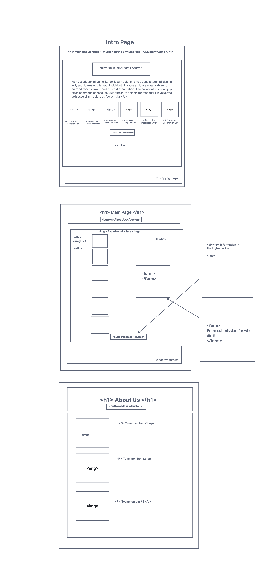
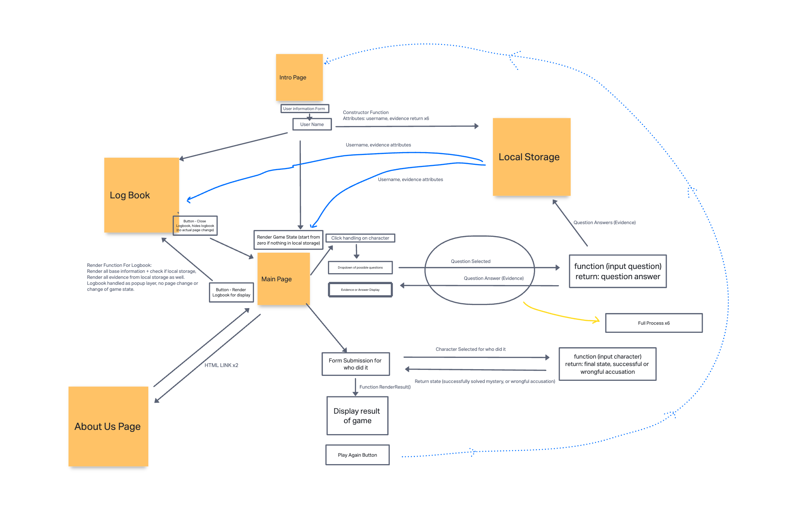

# Mystery Game - Midnight
An interactive, browser-based, point and click / text based, whodunit murder mystery game that engages users in a captivating narrative experience. Utilizing vanilla HTML, CSS, and JavaScript, the game features a small but eclectic cast of characters to interact with that challenges players to solve the mystery using critical thinking, and problem-solving. 

## Project Authors

Jennifer Sung, Aaron Clark, and Dylan Cooper

## Wireframes

## Domain Model

## Original Art

All original art provided by [Jack Panic](https://linktr.ee/thedungeonmanager?utm_source=linktree_profile_share&ltsid=33927ca6-b344-4bc8-942f-45fce8acc42d)

## References

Code commenting help provided by ChatGPT.  Any Code snippets provided by chatGPT are commented in the code as such.
